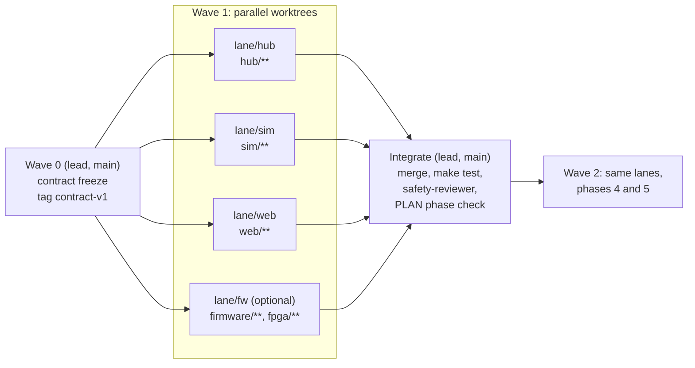

# Parallel work plan

How many Claude instances to run, what each one owns, and how their work comes back together.

**Team of 4?** See [`TEAM.md`](TEAM.md) for who runs which lane, with personal checklists and sync points. With four people the fw lane is on.

**The goal is the most progress with the fewest parallel instances.** Every extra instance adds merge risk and coordination cost. We run **one lead plus three lanes**. A fourth (firmware) lane runs only when someone is at the bench with the hardware.

## Why this split

The PLAN phases form a chain, and the protocol is the contract everything hangs on. So:

1. **Freeze the contract first, with one instance.** Then nobody waits on, or breaks, anybody else.
2. **Split by folder, not by feature.** Each lane owns a set of folders that no other lane touches, which makes merges conflict-free by construction. Folder lines match our existing subagents and team roles.
3. **Integrate only on `main`, only through the lead.**



## Lanes

| Lane | Branch | Worktree | Owns (may edit) | Subagent | Ports / ids |
|---|---|---|---|---|---|
| **lead** | `main` | `./` (this checkout) | `shared/**`, `docs/**`, `scripts/**`, `.claude/**`, `Makefile`, `requirements.txt`, `pyproject.toml`, `README.md`, `CLAUDE.md`, `.env.example`, `.gitignore` | `safety-reviewer` | hub 8000, `pump-001`, broker 1883 (shared by all) |
| **hub** | `lane/hub` | `../Biohack2-hub` | `hub/**` | `hub-engineer` | hub 8001, `pump-hub` |
| **sim** | `lane/sim` | `../Biohack2-sim` | `sim/**` | `sim-engineer` | `pump-sim` |
| **web** | `lane/web` | `../Biohack2-web` | `web/**` | `web-engineer` | mock API 8003 |
| **fw** (optional) | `lane/fw` | `../Biohack2-fw` | `firmware/**`, `fpga/**` | `firmware-engineer` | `pump-001` on the bench |

Ownership is **enforced**. `scripts/worktrees.sh` writes a `.lane` file into each worktree, and `.claude/hooks/lane_guard.py` blocks Claude's Edit and Write tools on any path outside that lane. The lead checkout has no `.lane` file and can edit anything. The guard only covers Claude's file tools; shell redirects get around it, so the rule still applies to people.

The lanes share one Mosquitto broker (started once with `make broker` in the lead checkout). Each lane uses its own `PUMP_ID`, so their MQTT topics never cross.

## Wave 0: contract freeze (lead only, on `main`, before any lane starts)

None of this is application code. It is everything two lanes would otherwise both need to change.

- [ ] Decide R1 (PRD §10): add optional `last_rejected_version` and `last_reject_reason` to `status.schema.json`, with an example and a note in `docs/PROTOCOL.md`. Fix the QoS column in `topics.md`.
- [ ] Review and freeze `docs/API.md`, the HTTP and SSE contract between hub and web.
- [ ] R3: `persistence true` in `scripts/mosquitto.conf`.
- [ ] R4 and R5: `jsonschema[format]` and `fastapi>=0.135` in `requirements.txt`. Add a format checker in `shared/protocol/test_examples.py`.
- [ ] `make test` green. Commit, then `git tag contract-v1 && git push --tags`.
- [ ] `scripts/worktrees.sh up` (add `fw` if hardware is present).

## Wave 1: lane briefs (PLAN phases 1 and 2)

Each brief is a kickoff prompt. Open the worktree, run `make setup`, start `claude`, and paste the brief.

### hub lane

> You are the hub lane. Read `CLAUDE.md`, `docs/PARALLEL.md`, `docs/API.md`, `docs/PROTOCOL.md`, `docs/SAFETY.md`, and `docs/research/PRD.md` (§6, §8, §10 R3, R5, R6). Use the `hub-engineer` subagent approach. You may edit only `hub/**`.
>
> Build PLAN phase 1 and phase 2 hub items:
> - `hub/app/schema.sql` with append-only audit triggers.
> - The MQTT bridge: paho `CallbackAPIVersion.VERSION2`, subscribe in `on_connect`, hand off with `call_soon_threadsafe`.
> - Schema validation with a format checker.
> - Every endpoint and SSE stream exactly as in `docs/API.md`.
> - One publish gate.
> - A lifecycle engine that changes state only from pump data.
> - A re-publish on startup and whenever availability goes to online.
>
> Test against fake MQTT messages built from `shared/protocol/examples/`, not against the sim. Cover every unhappy path. Done means `make test` and `make lint` are green. Report what changed and anything the web or sim lane needs to know. If the contract seems wrong, **stop and report**; do not edit `shared/` or `docs/`.

### sim lane

> You are the sim lane. Read `CLAUDE.md`, `docs/PARALLEL.md`, `docs/PROTOCOL.md`, `docs/SAFETY.md`, `.claude/rules/firmware.md` (the sim must match it on the wire), and `docs/research/ARCHITECTURE-DIAGRAMS.md` §6, §7, §11. Use the `sim-engineer` approach. You may edit only `sim/**`.
>
> Build `sim/pump_sim.py`:
> - Uses `PUMP_ID`, `MQTT_HOST`, and `MQTT_PORT` from the environment.
> - Last Will plus retained online. On a graceful exit, publish offline (R8).
> - Status every 2 s, with `simulated: true`.
> - The state machine with a single `transition_to()`.
> - The validation order and rejection reasons exactly as in `PROTOCOL.md`.
> - Ignore silently when `version == current`.
> - Queue when not idle. Keyboard fault injection. A time-speed factor.
>
> Write pytest tests for each rejection reason, for queue-then-apply, and for retained replay. Keep `test_limits_match_firmware.py` green. Done means `make test` and `make lint` are green. Do not edit `shared/` or `docs/`; report contract problems instead.

### web lane

> You are the web lane. Read `CLAUDE.md`, `docs/PARALLEL.md`, `docs/API.md`, `.claude/rules/web.md`, and `docs/research/PRD.md` §6.4 and §7 (NFR-A1 to A6, R7). Use the `web-engineer` approach. You may edit only `web/**`.
>
> First build `web/_mock/mock_api.py`, a standard-library server on port 8003 that serves `web/` plus fake responses and an SSE stream exactly matching `docs/API.md`, so you never wait on the hub.
>
> Then build the family app (phase 1 live page, phase 2 "Change to review" with old versus new) and the clinician portal (the propose form and the status chip). Use `strings.en.js`. Add the "Prototype, not for clinical use" footer and "Simulated data" labels. Done means every screen passes the accessibility rules at phone width. Do not edit `shared/` or `docs/`; report contract problems instead.

### fw lane (only with hardware)

> You are the firmware lane. Read `CLAUDE.md`, `docs/PARALLEL.md`, `docs/PROTOCOL.md`, `docs/SAFETY.md`, `.claude/rules/firmware.md`, and `docs/research/PRD.md` §10 R1, R2, R8. Use the `firmware-engineer` approach. You may edit only `firmware/**` and `fpga/**`.
>
> Build PLAN phase 3:
> - `mqtt.setBufferSize(1024)` before connect (R2).
> - Last Will plus retained online.
> - A non-blocking reconnect.
> - `transitionTo()`.
> - Validation, queue, and apply with persistence to NVS, using the same reasons as the sim.
> - An actuator interface and fault buttons.
>
> Done means `make fw-build` is green, plus the bench checks in PLAN phase 3.

## Rules for every lane

1. **Stay in your folders.** The lane guard enforces it for Claude's file tools.
2. **Never edit `shared/`, `docs/`, `Makefile`, `requirements.txt`, or `PLAN.md` from a lane.** If you need one of those changed, stop and tell the lead. The lead changes it on `main`, and lanes pick it up with `git merge main`.
3. **Commit small and often on your lane branch.** Do not push to `main`.
4. **Sync from main at the start of each session:** `git fetch && git merge origin/main`. Because folders don't overlap, this should never conflict. If it does, someone broke rule 1.
5. **The safety invariants apply unchanged in every lane.** Run `safety-reviewer` on anything touching prescriptions, limits, or state.
6. **Need a new dependency?** Ask the lead to add it to `requirements.txt` on main.

## Integration (lead)

The lead runs `scripts/worktrees.sh merge`, or does the same steps by hand:

1. Merge in the order `lane/sim`, `lane/hub`, `lane/web`, `lane/fw`, using `git merge --no-ff lane/<x>` on `main`.
2. Run `make test` and `make lint` after each merge.
3. Run `safety-reviewer` over the combined diff.
4. Run the PLAN phase acceptance check end to end: broker, hub, sim, and both pages.
5. Tick the PLAN lines and push `main`. Lanes then merge `main` and start the next wave.

## Wave 2 and later

Use the same lanes and the same rules for phase 4 (reporting: hub queries, sim history, portal dashboard) and phase 5 (accessibility and personalization, mostly the web lane). Phase 6 (demo hardening) is lead only, on `main`, with no lanes.

## Commands

```bash
scripts/worktrees.sh up          # create lane/hub, lane/sim, lane/web worktrees next to this repo
scripts/worktrees.sh up fw       # also create the firmware lane
scripts/worktrees.sh status      # branches, worktrees, and how far ahead/behind main each lane is
scripts/worktrees.sh merge       # (lead) merge all lanes into main in order, running tests between
scripts/worktrees.sh down        # remove worktrees (branches are kept)

cd ../Biohack2-hub && make setup && claude    # one Claude instance per worktree
```
