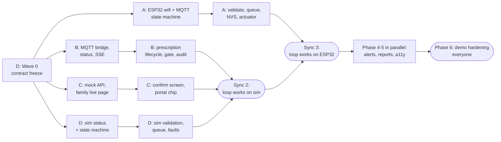

# Team split (4 people)

Who builds what, in what order, and what each person hands to the others. This turns `PLAN.md` phases, `research/PRD.md` requirements (FR, NFR, R1–R8), and the `PARALLEL.md` lanes into four personal checklists.

**Rule of thumb:** you own your folders (see `PARALLEL.md`). If you need something in someone else's folder, ask them. If you need a contract change (`shared/`, `docs/API.md`), ask Person D.

Prototype, not a medical device. All values are demo values.

## At a glance

| | Person A: Hardware | Person B: Hub | Person C: Web and accessibility | Person D: Sim, protocol, and pitch (lead) |
|---|---|---|---|---|
| Name | _______ | _______ | _______ | _______ |
| Lane / branch | `lane/fw` | `lane/hub` | `lane/web` | `main` + `lane/sim` |
| Owns | `firmware/`, `fpga/`, wiring, bench | `hub/`, the hub laptop (Docker) | `web/` | `shared/`, `docs/`, `scripts/`, `sim/`, Makefile, slides |
| Subagent | `firmware-engineer` | `hub-engineer` | `web-engineer` | `sim-engineer`, `safety-reviewer` |
| Demo role | Presses the fault button, explains limits in the pump | Runs the hub laptop, is the backup operator | Caregiver on the phone | Presenter and clinician on the laptop |
| Biggest risk they own | R1 and R2 (MQTT on the ESP32) | The S5 lifecycle and SSE | Accessibility pass, R7 phone choice | Contract drift, demo timing |

## Sync points (whole team, 10 minutes, standing)

| Sync | When | Pass condition (show it, don't describe it) | Then |
|---|---|---|---|
| **0 Kickoff** | Start | Everyone has the repo cloned, `make setup` and `make test` green, roles filled in above, R1 decided, phone chosen (R7) | D does Wave 0, everyone else starts reading their brief |
| **1 Skeleton** | ~10% of time | Broker, hub, and sim running; family page on a phone shows delivered volume rising (PLAN phase 1) | D merges the lanes |
| **2 Loop on sim** | ~35% | Propose 90 → confirm on phone → chip shows Pending, Sent, Active on pump; propose 500 → Rejected: rate out of range (PLAN phase 2) | `safety-reviewer`, merge, tag `loop-sim` |
| **3 Loop on hardware** | ~55% | The same check with the ESP32 instead of the sim, with no hub or web changes; pulling wifi mid-feed doesn't stop the feed (PLAN phase 3) | Merge, tag `loop-hw` |
| **4 Feature freeze** | ~85% | Occlusion → phone alert in ≤ 3 s plus portal flag; dashboard with 3 patients; screen reader and second language pass (PLAN phases 4–5) | Code freeze except bug fixes |
| **5 Dress rehearsal** | ~95% | Two clean timed runs, one on hardware and one on the sim fallback, internet off (PLAN phase 6) | Stop coding |

Anything not done at its sync point drops to the "Should" or "Stretch" list. Don't slide the sync.

---

## Person A: Hardware and firmware

**Mission:** a real pump that refuses a bad prescription on its own and keeps feeding with the wifi pulled.

**Folders:** `firmware/`, `fpga/`. **Worktree:** `scripts/worktrees.sh up fw` → `../Biohack2-fw`.

### Before Sync 1 (hardware bring-up, no dependencies)
- [ ] Inventory: ESP32, stepper and driver or LED stand-in, buttons, OLED? Decide `DELIVERY_SIMULATED` in `config.h` and tell D (it affects slides and labels).
- [ ] Wire the buttons (occlusion, bag empty, pause/clear) and the actuator. Confirm the pins in `config.h`.
- [ ] `secrets.h` from the example. `make fw-build` and `make fw-upload` blink test.
- [ ] Wifi plus MQTT: **`setBufferSize(1024)` before connect (R2)**. Last Will `offline` retained, then `online` retained. Non-blocking reconnect with `millis()` (FR-17, NFR-R1).
- [ ] Publish status every 2 s matching `status.schema.json`. Check with `mosquitto_sub -t 'pump/#' -v`.

### Before Sync 3
- [ ] State machine with a single `transitionTo()` publishing `state_changed` (ARCHITECTURE-DIAGRAMS §7).
- [ ] Prescription handling in the exact order from `PROTOCOL.md` (diagram §6). Ignore silently on `version == current`. Reject with a reason otherwise. Queue if not idle (FR-5, FR-6).
- [ ] R1 as decided at Sync 0 (status fields `last_rejected_version` and `last_reject_reason`, or switch to arduino-mqtt for QoS 1).
- [ ] Persist the current prescription and version in NVS `Preferences`, with keys of at most 15 characters (NFR-R2).
- [ ] Actuator interface (`start`, `stop`, `setRateMlHr`). Delivered volume from steps or from time × rate.
- [ ] Fault buttons → `alarm_raised` and `alarm_cleared`. Alarm → paused on clear (FR-16).
- [ ] Bench: test a prescription with a 200-character note (R2). Pull wifi mid-feed (S6). Calibrate `STEPS_PER_ML` if there's a real pump head.
- [ ] Run `safety-reviewer`.

### After Sync 3
- [ ] OLED: rate, state, "Updated remotely: v N" (FR-30).
- [ ] On a graceful restart, publish `offline` before disconnecting (R8).
- [ ] Stretch: foil level sensor → `level_pct` and `sensor_mismatch` (FR-X1). FPGA watchdog (FR-X2).
- [ ] Build the physical demo prop: label it "Prototype, not connected to a person".

**Needs from others:** D gives the frozen protocol (Wave 0) and a running sim to compare behaviour on the wire. B gives a hub that shows your status.
**Gives to others:** a pump id `pump-001` on the demo network by Sync 3; a 30-second "the limit lives in the device" explanation for the pitch.
**If there's no hardware:** you take over phase 5 accessibility testing from C and build the demo network (travel router or hotspot with data off, fixed IP). Ask D to re-plan.

---

## Person B: Hub (hub laptop in Docker, API, database, MQTT bridge)

**Mission:** the only component that talks to both sides; it never says "active" until the pump does.

**Folders:** `hub/`. **Worktree:** `../Biohack2-hub` (`HUB_PORT=8001`, `PUMP_ID=pump-hub`).

### Before Sync 1
- [ ] `hub/app/schema.sql`: all six tables (ARCHITECTURE-DIAGRAMS §9). Audit table append-only with `BEFORE UPDATE` and `BEFORE DELETE` triggers that `RAISE(ABORT)` (S7, REFERENCES R15).
- [ ] MQTT bridge: paho `CallbackAPIVersion.VERSION2`, subscribe in `on_connect`, `loop_start()`, hand messages to asyncio with `call_soon_threadsafe` (R5, diagram §3).
- [ ] Validate inbound messages against the schemas **with a format checker** (R4). Add `received_at`. Store.
- [ ] `GET /api/pumps/{id}/status` and the SSE stream with its initial snapshot, exactly as in `docs/API.md`. Serve `web/` as static files.
- [ ] Tests driven by `shared/protocol/examples/*.json`, with no broker needed.

### Before Sync 2
- [ ] `POST` propose, confirm, decline. Version allocator. 409 when not `proposed` (API.md).
- [ ] **One publish gate**: refuse without a confirmation (S2); validate outbound; retained, QoS 1 (FR-4).
- [ ] Lifecycle engine: `active`, `rejected`, and `superseded` **only** from pump events or status (S5, FR-7, FR-9, R6). `rejected` also from the R1 status fields.
- [ ] Re-publish the latest `sent` prescription on startup and whenever availability goes to online (R3).
- [ ] Availability tracking plus `last_seen_at` (FR-17).
- [ ] Tests for unconfirmed, out of range, stale, offline, superseded, and audit UPDATE raising an error.
- [ ] Run `safety-reviewer`.

### Before Sync 4
- [ ] Alerts: `GET /alerts` and the SSE `alert` event (FR-14, FR-15).
- [ ] `GET /api/patients` with exception rules: under target 3 days, more than N alarms a night, offline (FR-19).
- [ ] `GET /api/patients/{id}/daily` for delivered versus prescribed (FR-20). Rule-based weekly summary text (FR-21).
- [ ] Audit endpoint with caregiver roles (FR-23, FR-29). Profiles endpoint (FR-28).
- [ ] Load D's 30-day history into the database.

### Phase 6
- [ ] Hub laptop: `make docker-up` built while online (`compose.yaml`: broker with persistence, hub, optional sim), a fixed IP on the demo router, Windows firewall open for 8000 and 1883, `make docker-reset` tested. (The Pi broke; `scripts/setup_pi.sh` is kept only for reference.).
- [ ] Reset script support: a "return to v7 at 60 mL/hr, idle" seed (DEMO.md).

**Needs from others:** D gives the frozen API and protocol, plus the sim for end-to-end checks. C reports any API pain early, through D.
**Gives to others:** the real API on the hub laptop by Sync 2, so C can switch off the mock.

---

## Person C: Web apps and accessibility

**Mission:** a caregiver at 3 a.m., one-handed, in their own language, understands what happened and what to do.

**Folders:** `web/`. **Worktree:** `../Biohack2-web` (mock on port 8003).

### Before Sync 1
- [ ] `web/_mock/mock_api.py`: a standard-library server that serves `web/` and fakes every endpoint plus the SSE stream from `docs/API.md`. You never wait for B.
- [ ] Shared CSS tokens: 48 px targets, body text of at least 18 px, contrast of at least 4.5:1, visible focus, night palette (NFR-A1 to A3).
- [ ] `strings.en.js` with every user-facing string from day one (FR-25).
- [ ] Family live page: state, delivered versus target, online/offline with the last update time, `aria-live` status (FR-13, FR-17).
- [ ] The "Prototype, not for clinical use" footer and the "Simulated data" label component (NFR-H1, S8).

### Before Sync 2
- [ ] Family "Change to review": old versus new, Confirm and Decline of equal weight (FR-3).
- [ ] Clinician portal: propose form (shape validation only, **no limit check**: FR-2) and a status chip showing Pending, Sent, Active on pump, or Rejected with the reason, driven only by SSE (FR-7).
- [ ] Switch from the mock to B's hub and test on the real phone chosen at Sync 0.

### Before Sync 4
- [ ] Alert screen: picture, cause, numbered steps, "Done"; vibrate where supported, plus spoken status. Ask for an "Enable alerts" tap on first load (FR-14, NFR-A6, R7).
- [ ] Portal: patient list with exceptions first, a delivered versus prescribed chart (plain SVG, no CDN), an alarm timeline, and the audit view (FR-19, FR-20, FR-23).
- [ ] Second language plus a switch. Night mode. `prefers-reduced-motion` (FR-25, FR-26).
- [ ] `speechSynthesis` preferring `localService` voices. Optional voice confirm that always has a button (FR-27, NFR-A5).
- [ ] Feed profiles that pre-fill the proposal form. Caregiver picker (parent or school nurse) (FR-28, FR-29).
- [ ] **Accessibility pass:** screen reader confirm flow, keyboard only, 320 px width, contrast check (M4).

**Needs from others:** D gives the frozen API and the second-language decision. B gives the real hub by Sync 2. A gives the alarm pictures and steps if the physical setup changes.
**Gives to others:** screenshots for D's slides; the caregiver role in the demo.

---

## Person D: Sim, protocol, integration, and pitch (lead)

**Mission:** keep the contract stable, keep the sim identical to the pump, keep `main` green, and win the room.

**Folders:** `main` (`shared/`, `docs/`, `scripts/`, Makefile, requirements) plus `sim/` (worktree `../Biohack2-sim`, `PUMP_ID=pump-sim`).

### Wave 0 (first, before others need it; see PARALLEL.md)
- [x] Apply the R1 decision to `status.schema.json`, plus an example and a PROTOCOL.md note. Fix the QoS column in `topics.md`.
- [x] R3: `persistence true`. R4: `jsonschema[format]` plus a format checker. R5: `fastapi>=0.135`.
- [x] Freeze `docs/API.md` with B and C (15 minutes, together). Tag `contract-v1`. Run `scripts/worktrees.sh up hub sim web fw` (with no arguments it creates only hub, sim, and web).

### Before Sync 1 and Sync 2 (sim lane)
- [x] `sim/pump_sim.py`: environment config, Last Will plus online, status every 2 s with `simulated: true` (FR-11).
- [x] The same state machine and validation order and reasons as the firmware. Ignore silently on `version == current`. Queue when busy (FR-5, FR-6).
- [x] Publish `offline` on a graceful exit (R8). Keyboard fault injection. A time-speed factor.
- [x] pytest for each rejection reason, queue then apply, and retained replay. The limits parity test stays green.

### Before Sync 4
- [x] `sim/generate_history.py`: 30 days, 3 fictional patients (on target, drifting under, night occlusions), every row `simulated` (FR-18).
- [x] Scripted scenarios for rehearsals (start feed, occlusion, clear).
- [ ] Ask A whether the firmware and sim still behave the same on the wire.

### Lead duties (all through the hackathon)
- [ ] At each sync: `scripts/worktrees.sh merge`, `safety-reviewer`, the PLAN check, tick `PLAN.md`, push. Tell the lanes to `git merge origin/main`.
- [ ] Handle contract change requests. Nobody else edits `shared/` or `docs/`.
- [ ] Keep the scope list honest: move unfinished items to Should or Stretch at each sync.

### Pitch and demo (start the outline at Sync 2, not at the end)
- [ ] Slides: problem (REFERENCES §1), what exists today (Kangaroo Connect, R3; check the manual first), our loop, safety design (S1–S8, defence in depth), cost argument, honest gaps (SAFETY.md, IEC 60601-2-24, ENFit, FDA cybersecurity), next steps.
- [ ] `docs/DEMO.md` final script with the roles from "At a glance". Reset script. Screen recording fallback. (Reset script done: `make reset-demo`.)
- [ ] Time the slot; rehearse three times (Sync 5).

**Needs from others:** decisions at Sync 0; screenshots from C; a hardware status call from A by Sync 3.
**Gives to others:** the contract, a working sim by Sync 1, green merges.

---

## Hand-off contracts (where people depend on each other)

| From | To | What | By |
|---|---|---|---|
| D | everyone | `contract-v1` tag (protocol plus API) | Before anyone writes lane code |
| D | B, C, A | A running sim (`make sim`) on the shared broker | Sync 1 |
| C | — | A mock API, so C needs nothing from B | Sync 1 |
| B | C | The real hub API on the hub laptop | Sync 2 |
| A | D, B | The ESP32 online as `pump-001` | Sync 3 |
| D | B | 30-day history data | Sync 4 minus a bit |
| C | D | Screenshots for slides | Sync 4 |

## If someone is stuck or away

| Missing | Who covers | What gets dropped |
|---|---|---|
| A (hardware) | The sim becomes the demo pump (it's wire-identical); D says so on stage | OLED, FPGA, level sensor |
| B (hub) | D, with the `hub-engineer` subagent in the hub worktree | Reports (FR-19 to FR-21) move to Stretch |
| C (web) | A, if there's no hardware; otherwise D | Second language, voice |
| D (lead) | B takes the merges; C takes the slides | History generator becomes Stretch |
