# Architecture diagrams

*Companion to [`PRD.md`](PRD.md) and [`../ARCHITECTURE.md`](../ARCHITECTURE.md). Mermaid renders on GitHub, in VS Code (Markdown Preview Mermaid Support), and at mermaid.live. `R#` labels refer to the recommendations in PRD section 10. Prototype, not a medical device.*

1. [System context](#1-system-context)
2. [Deployment on the demo network](#2-deployment-on-the-demo-network)
3. [Hub internals](#3-hub-internals)
4. [Remote programming loop: happy path](#4-remote-programming-loop-happy-path)
5. [Remote programming loop: unhappy paths](#5-remote-programming-loop-unhappy-paths)
6. [Pump prescription validation](#6-pump-prescription-validation)
7. [Pump state machine](#7-pump-state-machine)
8. [Hub prescription lifecycle](#8-hub-prescription-lifecycle)
9. [Data model](#9-data-model)
10. [Alarm to plain-language alert](#10-alarm-to-plain-language-alert)
11. [Connectivity loss and reconnect](#11-connectivity-loss-and-reconnect)
12. [Defence in depth](#12-defence-in-depth)

---

## 1. System context

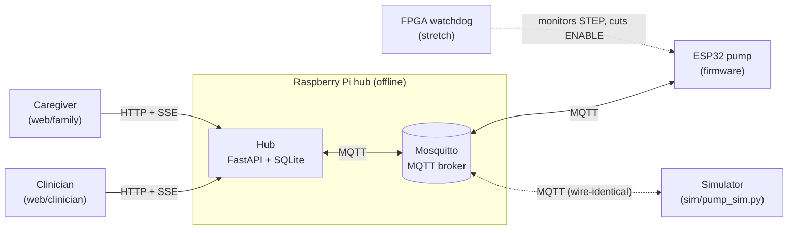

Rules shown: browsers never use MQTT, pumps never use HTTP, and the hub is the only component with a database.

## 2. Deployment on the demo network

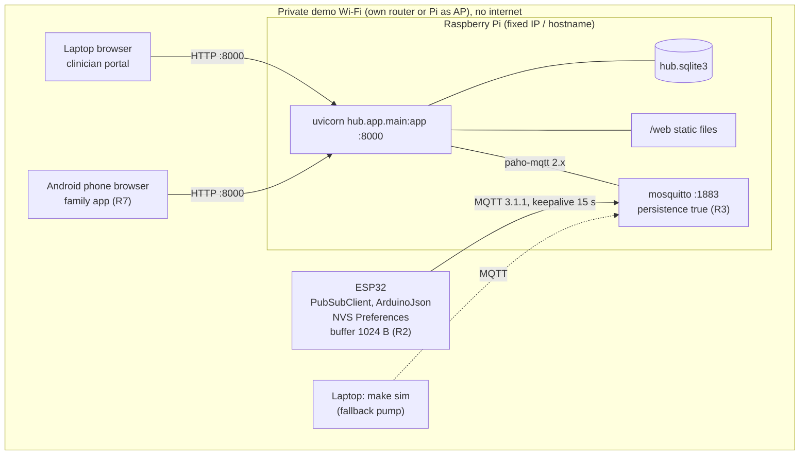

## 3. Hub internals

paho-mqtt runs its network loop in a background thread (`loop_start()`), and FastAPI runs on asyncio. The handoff between them must go through `loop.call_soon_threadsafe` (R5).

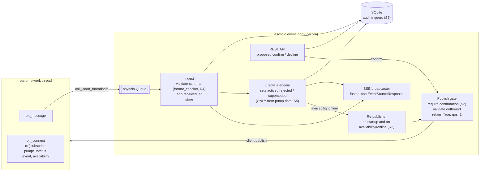

## 4. Remote programming loop: happy path

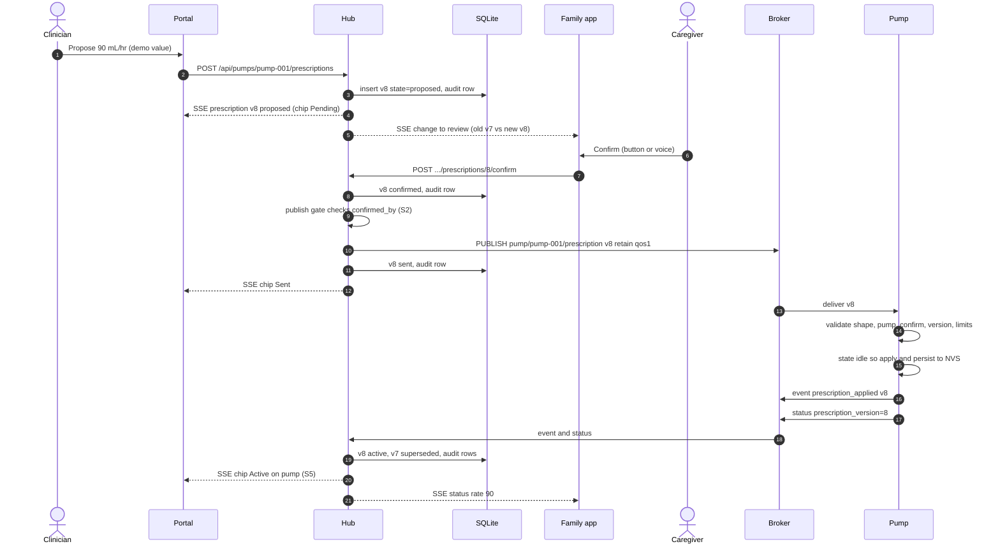

## 5. Remote programming loop: unhappy paths

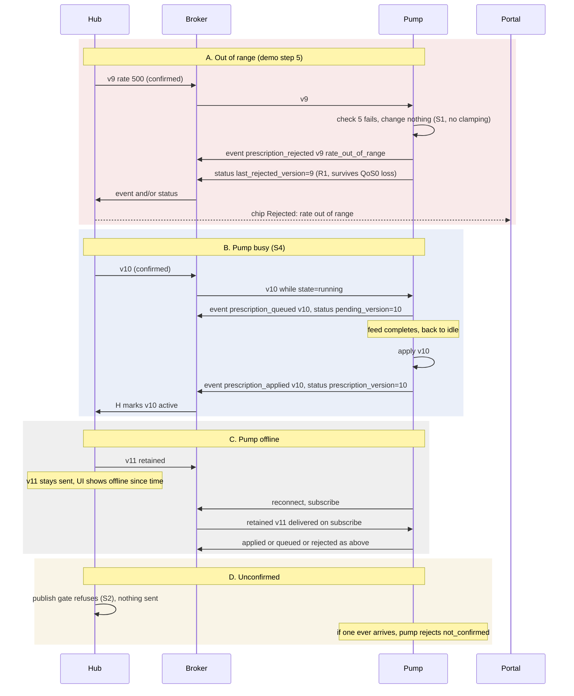

## 6. Pump prescription validation

The same order runs in the firmware and the sim (`docs/PROTOCOL.md`). The first failure wins.

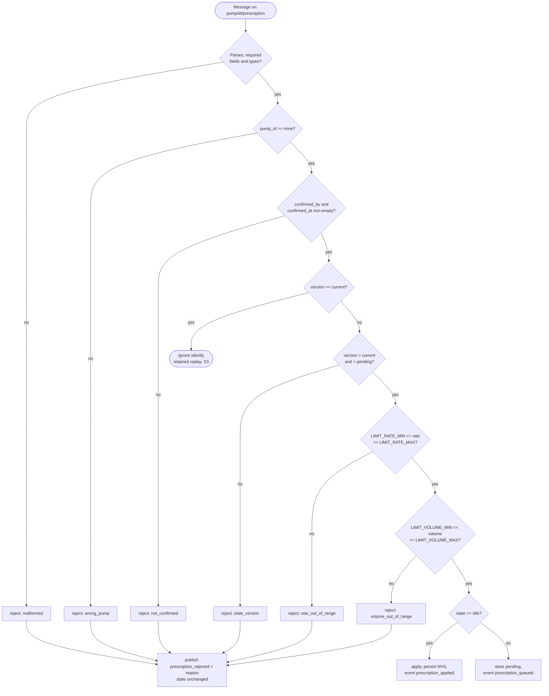

## 7. Pump state machine

There is a single `transitionTo()`, which publishes `state_changed` on every transition.

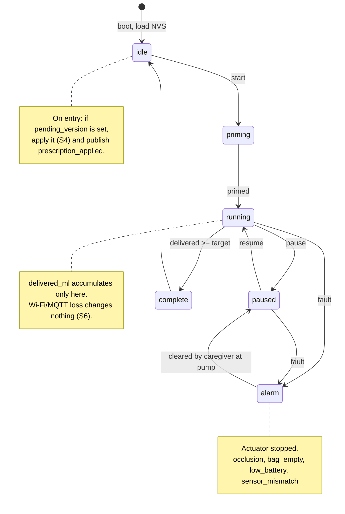

## 8. Hub prescription lifecycle

Transitions marked *pump* are allowed only on the MQTT ingest path (S5).

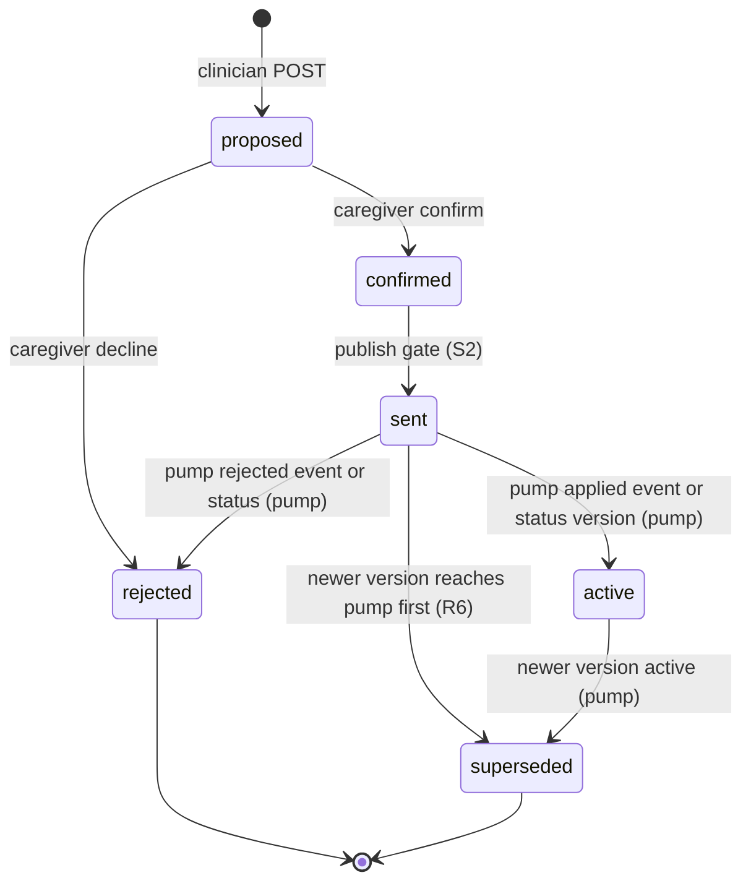

## 9. Data model

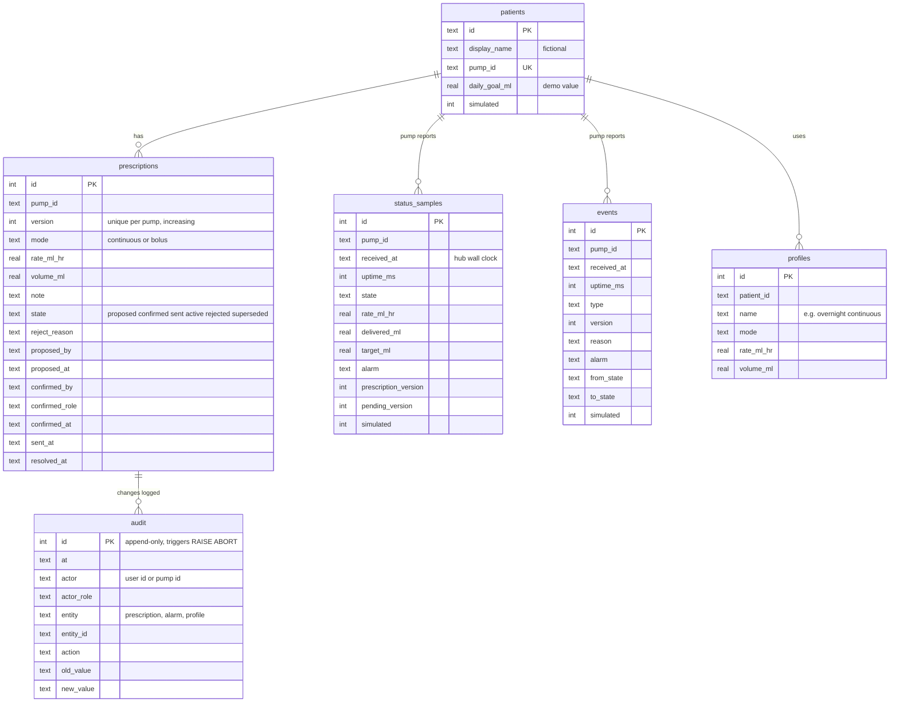

## 10. Alarm to plain-language alert

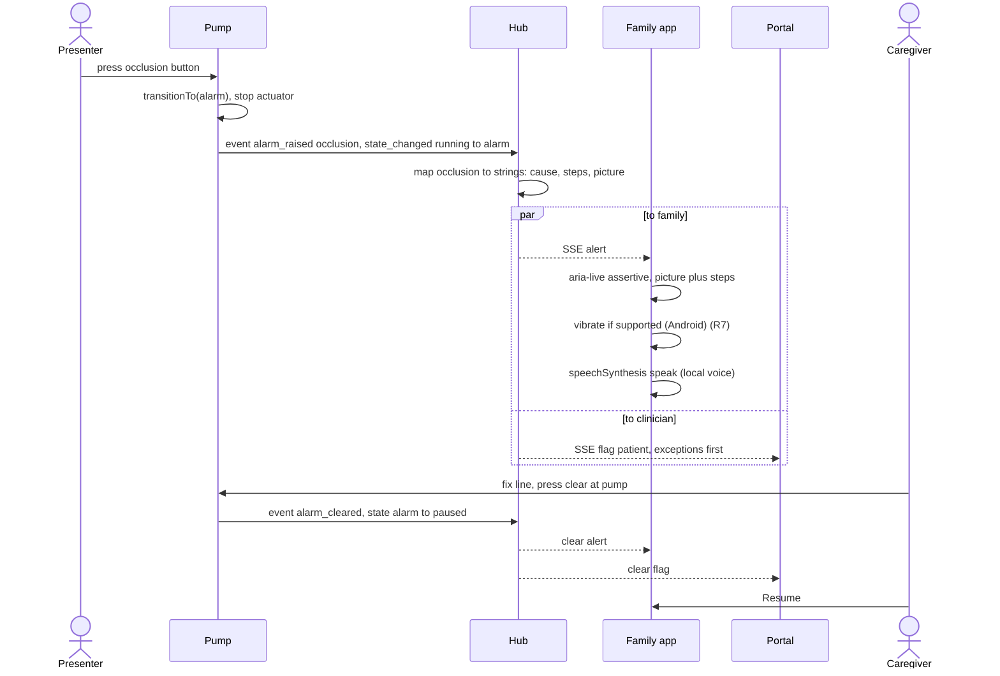

## 11. Connectivity loss and reconnect

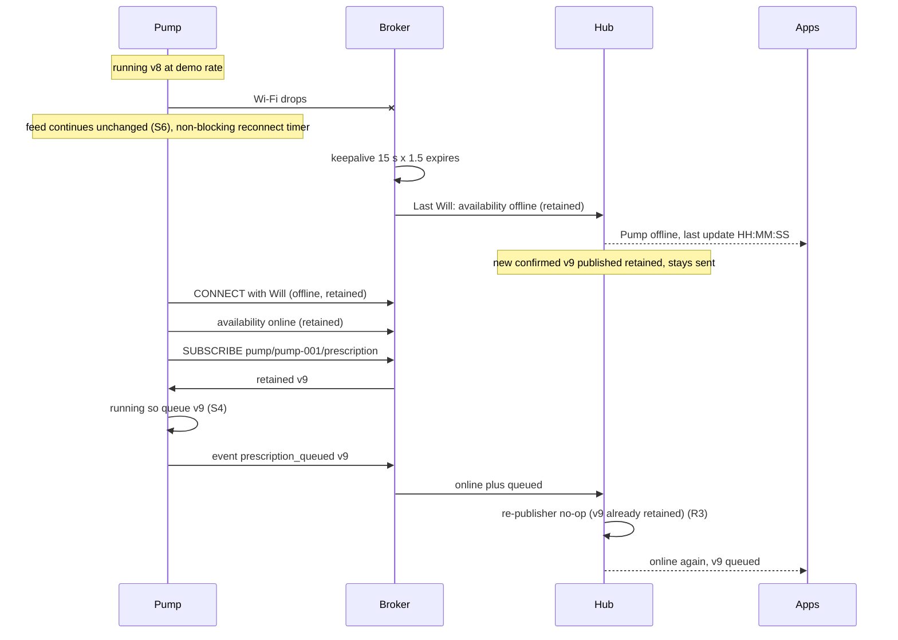

## 12. Defence in depth

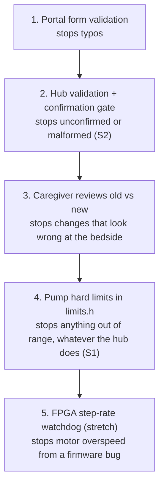
